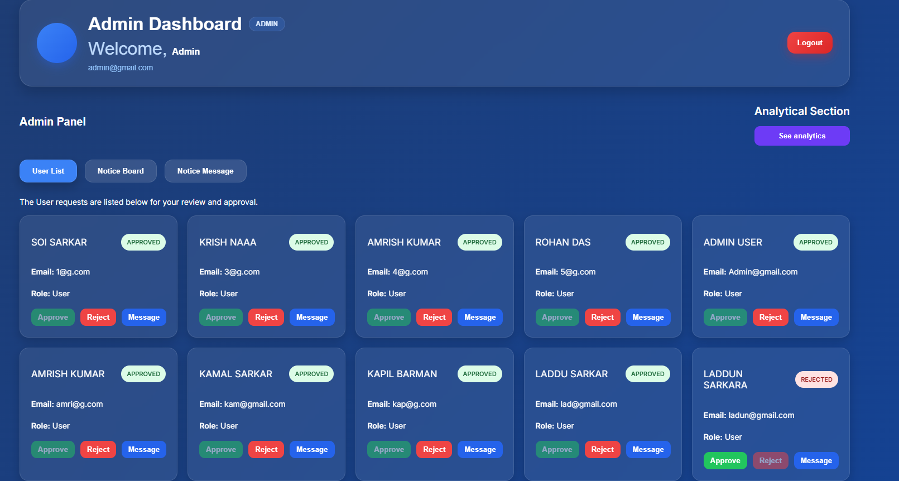
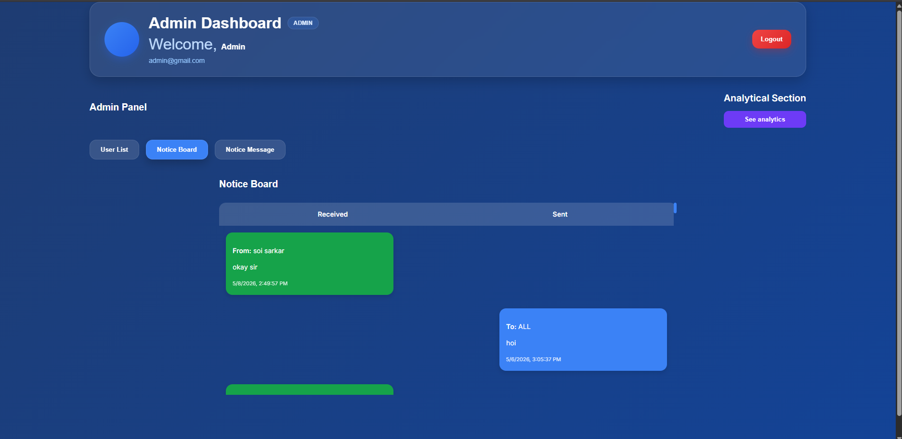
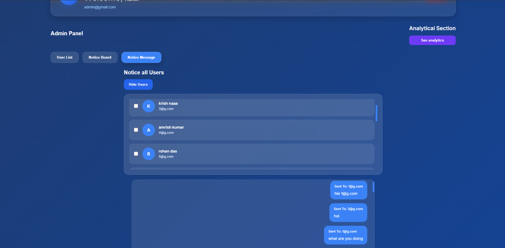
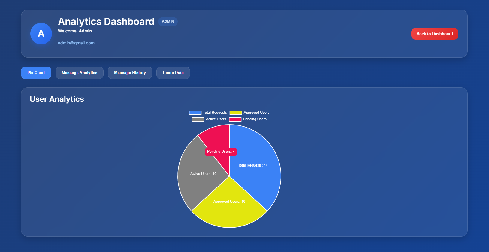
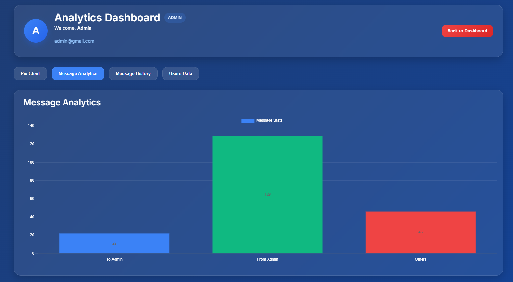
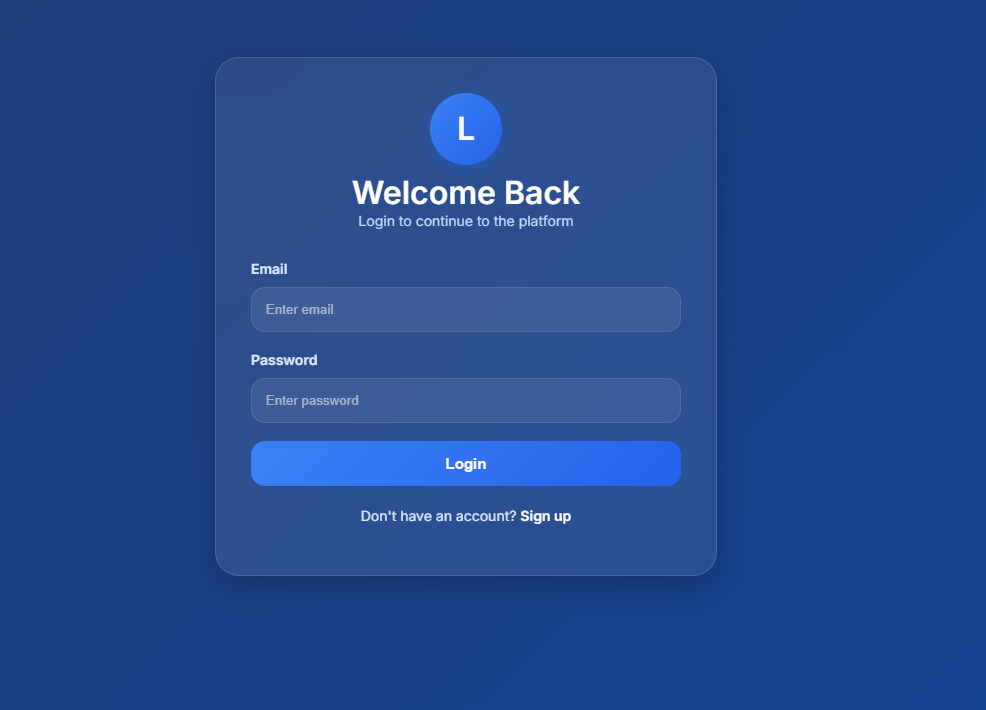
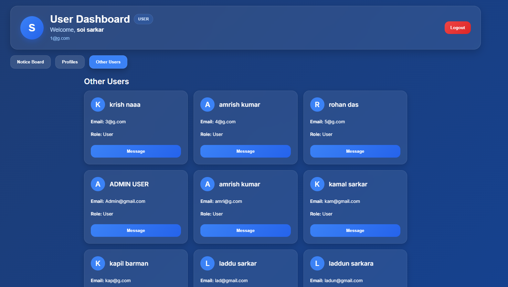

# Secure Real-Time Chat Application

A full-stack secure real-time chat application built using:

  * Angular
  * ASP.NET Core Web API
  * PostgreSQL
  * CouchDB
  * SignalR
  * JWT Authentication
  * RSA Encryption

This project supports:

  * User/Admin authentication
  * Real-time messaging
  * Notice board system
  * Multi-user messaging
  * User approval system
  * Analytics dashboard
  * Session protection
  * Single-tab enforcement
  * Inactivity timeout
  * RSA encrypted messages

Because apparently simple login systems were too emotionally stable.

---

# 📌 Features

## ✅ Authentication System

  * JWT-based login
  * Signup approval system
  * Admin/User role handling
  * Secure route protection
  * Backend authorization validation
  
  ---

## ✅ User Features

  * Personal dashboard
  * View admin announcements
  * Chat with other users
  * View other user profiles
  * Real-time updates using SignalR
  * Session timeout monitoring
  
  ---

## ✅ Admin Features
  
  * Approve/Reject users
  * Send notice messages
  * Send messages to multiple users
  * Broadcast announcements
  * Analytics dashboard
  * Message history tracking
  * User management
  
  ---

## ✅ Security Features

### JWT Authentication

Secure token-based login system.

### RSA Encryption

Messages are encrypted before storing in PostgreSQL.

### Single-Tab Restriction

One user can only use one active tab.

### Backend Session Validation

Backend validates active tab ownership.

### Inactivity Timeout

* Admin "User List" tab timeout
* User "Other Users" tab timeout
* Auto logout after 20 seconds inactivity

### Protected APIs

Unauthorized copied sessions are blocked.

---

# 🏗️ Project Architecture

```text
Angular Frontend
       │
       ▼
ASP.NET Core Web API
       │
 ┌───────────────┐
 ▼               ▼
PostgreSQL     CouchDB
(Messages)     (Users)
       │
       ▼
SignalR Hub
(Real-time updates)
```

---

# 📂 Project Structure

## Frontend (Angular)

```text
src/
 ├── app/
 │   ├── login/
 │   ├── signup/
 │   ├── dashboard/
 │   ├── user-dashboard/
 │   ├── analytics/
 │   ├── chat/
 │   ├── services/
 │   │    ├── auth.service.ts
 │   │    ├── signalr.service.ts
 │   │    └── auth.interceptor.ts
 │   └── app.routes.ts
```

---

## Backend (.NET)

```text
Controllers/
 ├── AuthController.cs
 ├── MessageController.cs

Models/
 ├── User.cs
 ├── Message.cs
 ├── LoginRequest.cs

Services/
 ├── RsaService.cs

Hubs/
 ├── ChatHub.cs
```

---

# ⚙️ Technologies Used

| Technology   | Purpose                 |
| ------------ | ----------------------- |
| Angular      | Frontend UI             |
| ASP.NET Core | Backend API             |
| PostgreSQL   | Message storage         |
| CouchDB      | User storage            |
| SignalR      | Real-time communication |
| JWT          | Authentication          |
| RSA          | Message encryption      |
| Tailwind/CSS | UI styling              |

---

# 🔄 Complete Workflow

# 1️⃣ User Signup

```text
User fills signup form
        │
        ▼
Angular sends request
        │
        ▼
ASP.NET API validates data
        │
        ▼
Password encrypted using BCrypt
        │
        ▼
User stored in CouchDB
        │
        ▼
Status = Pending
```

---

# 2️⃣ Admin Approval

```text
Admin Dashboard
       │
       ▼
Fetch pending users
       │
       ▼
Approve/Reject user
       │
       ▼
Update CouchDB status
```

---

# 3️⃣ User Login

```text
User enters email/password
        │
        ▼
Angular sends login request
        │
        ▼
Backend validates credentials
        │
        ▼
JWT Token generated
        │
        ▼
Token stored in sessionStorage
        │
        ▼
Dashboard opened
```

---

# 4️⃣ Chat System Workflow

```text
User sends message
       │
       ▼
Angular API request
       │
       ▼
Backend encrypts message using RSA
       │
       ▼
Encrypted message stored in PostgreSQL
       │
       ▼
SignalR broadcasts realtime event
       │
       ▼
Receiver instantly gets message
```

---

# 5️⃣ Single Tab Protection Workflow

```text
User logs in
      │
      ▼
Unique tabId generated
      │
      ▼
Backend stores ActiveTabId
      │
      ▼
Every API validates:
JWT + X-Tab-Id
      │
      ▼
Copied sessions blocked
```

---

# 6️⃣ Notice Board Workflow

```text
Admin sends notice
       │
       ▼
Message stored in PostgreSQL
       │
       ▼
Receiver = ALL
       │
       ▼
Users fetch broadcast messages
       │
       ▼
Displayed in Notice Board
```

---

# 7️⃣ Analytics Workflow

```text
Analytics component loads
       │
       ▼
Fetch messages/users
       │
       ▼
Process statistics
       │
       ▼
Render charts/tables
```

# 🖼️ Application UI Screenshots

---

# 🔐 Login Page

Features:
- JWT Authentication
- Secure Login
- Responsive UI
- Session-based Authentication


---

# 👨‍💼 Admin Dashboard

Features:
- Admin Control Panel
- User Management
- Notice Board
- Notice Messaging
- Analytics Navigation
- Multi-user Messaging



---

# 📢 Admin Notice Board

Features:
- Broadcast Messaging
- Admin-to-All Announcements
- Realtime Notice Updates
- Scrollable Notice Interface



---

# 💬 Admin Notice Messaging System

Features:
- Multi-user Selection
- Group Messaging
- Realtime Chat Updates
- Admin Messaging Interface



---

# 📊 Analytics Dashboard

Features:
- Message Analytics
- User Statistics
- Realtime Data Visualization
- Analytics Navigation Tabs



---

# 📈 Message Analytics Chart

Features:
- Message Statistics
- Dynamic Chart Rendering
- User Activity Visualization
- Realtime Analytics Updates



---

# 👤 User Dashboard

Features:
- User Profile
- Notice Board
- Other Users Section
- Secure Session Handling
- Responsive Dashboard UI



---

# 👥 User Profile Section

Features:
- User Information
- Admin Profile
- Dashboard Tabs
- Responsive Card Layout



---

# 🔒 Security Features

Implemented Security:
- JWT Authentication
- RSA Message Encryption
- Backend Session Validation
- Single Active Tab Restriction
- Inactivity Timeout
- Protected APIs
- BCrypt Password Hashing

---

# ⚡ Real-Time Features

Implemented using SignalR:
- Instant Messaging
- Live Notice Updates
- Dynamic Dashboard Refresh
- Realtime User Communication

---

# 🗄️ Database Architecture

## PostgreSQL
Stores:
- Encrypted messages
- Chat history
- Broadcast notices

## CouchDB
Stores:
- User data
- User roles
- Approval status
- Session ownership

---

# ⏳ Session Timeout System

Features:
- 20-second inactivity timeout
- Protected monitored tabs
- Auto logout
- Activity-based timer reset

---

# 🔐 Single Tab Restriction

Features:
- One active tab per user
- Backend ActiveTabId validation
- Session ownership validation
- Unauthorized session blocking

---

---

# 🚀 How to Run the Project

# 1️⃣ Clone Repository

```bash
git clone https://github.com/SH4IKVT/The-Chat-App.git

```

---

# 2️⃣ Frontend Setup (Angular)

## Install Dependencies

```bash
npm install
```

## Run Angular Project

```bash
ng serve
```

Frontend runs on:

```text
http://localhost:4200
```

---

# 3️⃣ Backend Setup (.NET)

## Open Backend Project

```bash
cd BackendProject
```

## Restore Packages

```bash
dotnet restore
```

## Run Backend

```bash
dotnet run
```

Backend runs on:

```text
http://localhost:5119
```

---

# 4️⃣ PostgreSQL Setup

Create database:

```sql
CREATE DATABASE chatdb;
```

Create table:

```sql
CREATE TABLE messages (
    id SERIAL PRIMARY KEY,
    sender_email TEXT,
    receiver_email TEXT,
    message TEXT,
    created_at TIMESTAMP DEFAULT CURRENT_TIMESTAMP
);
```

---

# 5️⃣ CouchDB Setup

Create database:

```text
userdb
```

Default CouchDB URL:

```text
http://localhost:5984
```

---

# 6️⃣ SignalR Setup

SignalR hub is configured inside:

```text
Program.cs
```

Hub endpoint:

```text
/chatHub
```

---

# 🔐 Authentication Flow

```text
Login
  │
  ▼
JWT Generated
  │
  ▼
Stored in sessionStorage
  │
  ▼
Auth Interceptor adds:
Authorization Bearer Token
  │
  ▼
Protected APIs validated
```

---

# 🔒 RSA Encryption Flow

```text
Message Typed
      │
      ▼
RSA Encrypt()
      │
      ▼
Encrypted Text Stored in DB
      │
      ▼
RSA Decrypt()
      │
      ▼
Displayed in UI
```

---

# 📊 Analytics Features

* User statistics
* Message history
* Pie charts
* Total users
* Total messages
* Real-time analytics updates

---

# 🧠 Key Learning Outcomes

This project demonstrates:

* Full-stack development
* Real-time communication
* Authentication systems
* API integration
* Secure session handling
* Encryption concepts
* Role-based authorization
* Database integration
* Angular state management
* ASP.NET backend development

---

# 🛡️ Security Improvements Implemented

* JWT route protection
* Backend tab validation
* Session ownership validation
* Inactivity timeout
* Single active tab restriction
* RSA encrypted messages
* BCrypt password hashing

---

# 📌 Future Improvements

* Video calling
* File sharing
* Typing indicators
* Read receipts
* Dark/Light theme
* Docker deployment
* Redis session management
* Refresh token rotation
* WebRTC integration

---

# 👨‍💻 Author

Developed as a secure real-time chat application project using Angular and ASP.NET C
